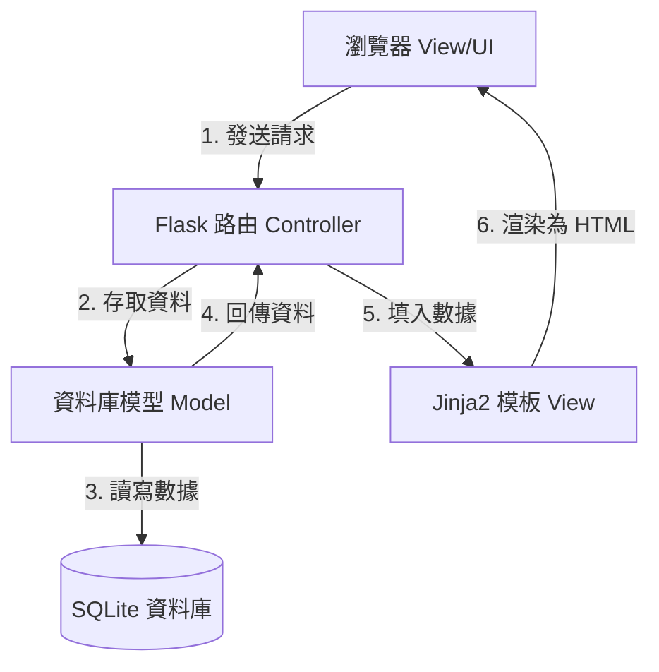

# 系統架構設計文件 (System Architecture) - 任務管理系統

本文件說明「任務管理系統」的技術選型、目錄結構、MVC 運作模式、元件關係圖以及關鍵的設計決策，供開發團隊參考。

---

## 1. 技術架構說明

本系統採用輕量、穩定且易於部署的技術組合，並遵循經典的 **MVC (Model-View-Controller)** 軟體設計模式。

### 選用技術與原因

| 技術元件 | 選擇之技術 | 選擇原因 |
| :--- | :--- | :--- |
| **程式語言** | Python 3 | 語法簡潔、生態系豐富，適合快速開發與教學。 |
| **後端框架** | Flask | 微框架 (Micro-framework)，核心輕量，不強制規定專案結構，開發彈性大，學習曲線平緩。 |
| **前端渲染** | Jinja2 | Flask 內建的模板引擎。可以在 HTML 中直接寫 Python 風格的邏輯（如迴圈、條件判斷），在伺服器端完成渲染，不需要複雜的前端編譯。 |
| **資料庫** | SQLite | 輕量級關聯式資料庫。資料庫儲存為單一檔案，無須安裝、啟動獨立的資料庫伺服器（如 MySQL/PostgreSQL），極易於部署與分享。 |
| **樣式設計** | Vanilla CSS (CSS3) | 原生 CSS 提供最大控制度。透過響應式網格 (CSS Grid/Flexbox) 即可打造精美且兼顧手機與電腦的響應式網頁 (RWD)。 |

### Flask 中的 MVC 模式說明
雖然 Flask 本身沒有像 Django 或 Ruby on Rails 一樣強制規定 MVC 目錄結構，但我們在專案中自主實行 MVC 架構，以確保程式碼職責分離、好維護：



*   **Model (模型 - `app/models/`)**：
    *   負責**資料庫操作與資料結構**。
    *   定義任務 (Task) 的欄位與資料類型，並封裝與資料庫互動的邏輯（例如：`get_all()`、`create()`、`update()`、`delete()`）。
*   **View (視圖 - `app/templates/`)**：
    *   負責**使用者介面呈現**。
    *   使用 Jinja2 模板引擎編寫 HTML 檔案，接收 Controller 傳入的任務資料，動態生成網頁外觀。
*   **Controller (控制器 - `app/routes/`)**：
    *   負責**業務邏輯與路由分發**。
    *   定義不同的 URL 路徑（例如 `/tasks`、`/tasks/add`），接收瀏覽器發送的 HTTP 請求 (GET/POST)，調用 Model 讀寫資料，並決定渲染哪一個 Jinja2 模板（View）回傳給瀏覽器。

---

## 2. 專案資料夾結構

專案資料夾結構規劃如下，所有開發工作均在此目錄下進行：

```text
web_app_development/
├── app/                        # 應用程式主目錄
│   ├── __init__.py             # 初始化 Flask App 封裝
│   ├── models/                 # Model 層：資料庫結構與操作
│   │   ├── __init__.py
│   │   └── task.py             # 任務 (Task) 的 Model 與資料操作
│   ├── routes/                 # Controller 層：路由與業務邏輯
│   │   ├── __init__.py
│   │   └── main.py             # 主頁面、任務新增/編輯/刪除/篩選/搜尋路由
│   ├── static/                 # 靜態資源（前端 CSS, JS, 圖片）
│   │   ├── css/
│   │   │   └── style.css       # 系統全域與元件樣式設計
│   │   └── js/
│   │       └── main.js         # 前端互動邏輯（如刪除確認、狀態即時切換等）
│   └── templates/              # View 層：Jinja2 HTML 模板
│       ├── base.html           # 基礎佈局（包含導覽列與全域結構）
│       ├── index.html          # 任務列表主頁面（含搜尋、篩選與列表展示）
│       └── edit.html           # 編輯任務頁面
├── docs/                       # 專案文件目錄
│   ├── PRD.md                  # 產品需求文件
│   └── ARCHITECTURE.md         # 系統架構設計文件（本檔案）
├── instance/                   # Flask 運行實例資料夾（排除在 git 外）
│   └── database.db             # SQLite 資料庫檔案
├── database/                   # 資料庫初始化檔案
│   └── schema.sql              # SQLite 建表 SQL 腳本
├── .gitignore                  # Git 忽略清單（排除 instance/ 與 __pycache__/）
├── app.py                      # 系統入口檔案，啟動 Flask 伺服器
├── README.md                   # 專案簡介說明
└── requirements.txt            # Python 套件依賴清單
```

---

## 3. 元件關係圖

以下展示使用者在系統中執行操作時，各元件之間的互動流程。

### 情境 A：使用者瀏覽任務列表 (含搜尋與篩選)

```mermaid
sequenceDiagram
    autonumber
    actor User as 使用者
    participant Browser as 瀏覽器
    participant Route as Flask 路由 (app/routes/main.py)
    participant Model as Task Model (app/models/task.py)
    database DB as SQLite (instance/database.db)
    participant Template as Jinja2 模板 (app/templates/index.html)

    User->>Browser: 輸入網址或進行搜尋篩選
    Browser->>Route: 發送 GET / 請求 (帶有 query 參數)
    Route->>Model: 呼叫 Task.get_all(status, keyword)
    Model->>DB: 執行 SELECT 查詢 SQL
    DB-->>Model: 回傳原始任務資料
    Model-->>Route: 回傳封裝後的 Task 物件清單
    Route->>Template: 傳遞 Task 清單至模板渲染
    Template-->>Route: 生成最終的 HTML 字串
    Route-->>Browser: 回傳 HTTP 200 與 HTML 網頁
    Browser-->>User: 顯示任務管理系統頁面
```

### 情境 B：使用者建立新任務

```mermaid
sequenceDiagram
    autonumber
    actor User as 使用者
    participant Browser as 瀏覽器
    participant Route as Flask 路由 (app/routes/main.py)
    participant Model as Task Model (app/models/task.py)
    database DB as SQLite (instance/database.db)

    User->>Browser: 填寫任務表單並點擊「儲存」
    Browser->>Route: 發送 POST /tasks/add 請求 (Form Data)
    Route->>Route: 驗證資料是否輸入正確
    Route->>Model: 呼叫 Task.create(title, description)
    Model->>DB: 執行 INSERT INTO SQL
    DB-->>Model: 確認寫入成功
    Model-->>Route: 回傳 True / 新任務 ID
    Route-->>Browser: 回傳 HTTP 302 重導向 (Redirect) 至首頁
    Browser->>Route: 重新發送 GET / 請求
    Note over Browser, Route: 流程如同情境 A，刷新列表顯示新任務
```

---

## 4. 關鍵設計決策

### 決策一：資料庫存取方式選擇
*   **決策**：使用原生 `sqlite3` 套件並搭配自訂的 Database Helper 與 Model 封裝，而非直接引入大型的 Flask-SQLAlchemy。
*   **理由**：
    1.  **輕量化**：本系統僅需一張任務表（`tasks`），原生 `sqlite3` 即可應對，無須增加額外套件依賴。
    2.  **學習意義**：透過手寫 SQL 查詢（如 `SELECT`、`INSERT`、`UPDATE`），能讓團隊成員更直覺地理解關聯式資料庫的底層運作，有利於後續維護。
    3.  **效能佳**：免去 ORM 套件的轉換開銷，查詢直接且快速。

### 決策二：前後端渲染模式
*   **決策**：採用伺服器端渲染 (SSR, Server-Side Rendering) 搭配 Jinja2，而非前後端分離 (如 React/Vue + RESTful API)。
*   **理由**：
    1.  **單一專案管理**：所有的 HTML 與 Python 程式碼都在同一個專案中，不需管理兩套伺服器，開發與部署極為簡便。
    2.  **Jinja2 優勢**：Jinja2 內建於 Flask，開箱即用，對於 CRUD 類型的簡單表單網頁，開發速度極快。
    3.  **無痛載入**：對學生與上班族用戶來說，伺服器端直接回傳完整 HTML，能提供最快且不需等待 AJAX 載入的首畫面展示。

### 決策三：狀態切換 (Toggle) 與刪除的互動方式
*   **決策**：在 `static/js/main.js` 中使用原生 JavaScript (fetch API) 處理任務完成狀態的切換，而刪除功能則使用表單或確認視窗後進行整頁刷新。
*   **理由**：
    1.  **流暢體驗**：使用者在勾選「已完成」時，若頁面每次都要整頁刷新，會產生閃爍與不適感。透過 JavaScript 非同步傳送狀態更新，能實現即時視覺回饋。
    2.  **安全刪除**：刪除是高敏感操作，使用 JavaScript 確認視窗 (confirm) 可以防範誤觸；確認後重導向，則能讓列表狀態保持絕對乾淨與一致。

### 決策四：使用 SQLite `instance` 目錄存放資料庫
*   **決策**：將 SQLite 資料庫檔案 `database.db` 放置在 Flask 預設的 `instance/` 資料夾中，並在 `.gitignore` 中將其排除。
*   **理由**：
    1.  **避免測試資料庫衝突**：每位開發者在本地測試時產生的資料庫檔案（包含測試資料）不會被 commit 上傳到 Git，避免互相覆蓋。
    2.  **安全性**：確保敏感的本地資料庫不會外洩至公共儲存庫。
