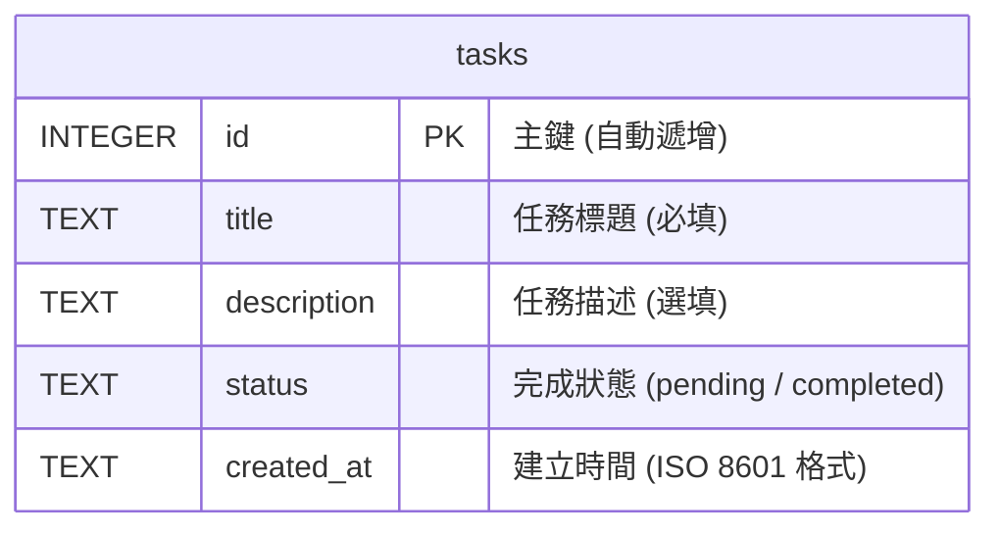

# 資料庫設計文件 (Database Design) - 任務管理系統

本文件說明「任務管理系統」的資料庫結構設計、欄位型態、建表 SQL 語法以及 Python Model 實作。本系統使用 **SQLite** 作為資料庫系統。

---

## 1. ER 圖（實體關係圖）

本系統目前為單一使用者任務管理系統，核心資料表為 `tasks` 表：



---

## 2. 資料表詳細說明

### `tasks` 資料表
用於儲存使用者的待辦任務資訊。

| 欄位名稱 (Column) | 資料型態 (SQLite) | 屬性 (Attributes) | 預設值 (Default) | 說明 (Description) |
| :--- | :--- | :--- | :--- | :--- |
| `id` | `INTEGER` | PRIMARY KEY, AUTOINCREMENT | | 任務的唯一識別碼，系統自動生成。 |
| `title` | `TEXT` | NOT NULL | | 任務標題，長度限制於前端/後端驗證（上限 100 字）。 |
| `description` | `TEXT` | | | 任務的詳細內容描述，可為空值。 |
| `status` | `TEXT` | NOT NULL | `'pending'` | 任務狀態，僅限 `'pending'`（未完成）或 `'completed'`（已完成）。 |
| `created_at` | `TEXT` | NOT NULL | `CURRENT_TIMESTAMP` | 任務建立時間，儲存為 UTC 時間之 ISO 8601 格式字串。 |

---

## 3. SQL 建表語法

建表語法儲存於 [schema.sql](file:///c:/Users/user/Downloads/新增資料夾 (2)/新增資料夾/web_app_development/database/schema.sql) 中，內容如下：

```sql
-- 建立 tasks 資料表
CREATE TABLE IF NOT EXISTS tasks (
    id INTEGER PRIMARY KEY AUTOINCREMENT,
    title TEXT NOT NULL,
    description TEXT,
    status TEXT NOT NULL DEFAULT 'pending',
    created_at TEXT NOT NULL DEFAULT (datetime('now', 'localtime'))
);

-- 建立索引以優化搜尋與篩選效能
CREATE INDEX IF NOT EXISTS idx_tasks_status ON tasks(status);
CREATE INDEX IF NOT EXISTS idx_tasks_created_at ON tasks(created_at);
```

---

## 4. Python Model 程式碼設計

為了實作資料庫的 CRUD 操作，我們將資料庫連接工具設計於 `app/db.py`，並在 [task.py](file:///c:/Users/user/Downloads/新增資料夾 (2)/新增資料夾/web_app_development/app/models/task.py) 中定義 `Task` 類別來封裝所有的資料庫存取方法。

### 資料庫連接工具 (`app/db.py`)
```python
import sqlite3
import os
from flask import g, current_app

def get_db():
    """取得資料庫連線，並將連線物件綁定在 Flask g 物件中"""
    if 'db' not in g:
        # 確保 instance 目錄存在
        os.makedirs(current_app.instance_path, exist_ok=True)
        db_path = os.path.join(current_app.instance_path, 'database.db')
        
        g.db = sqlite3.connect(db_path)
        # 設定回傳型態為 Row 物件，可透過欄位名稱存取欄位值
        g.db.row_factory = sqlite3.Row
    return g.db

def close_db(e=None):
    """關閉目前請求的資料庫連線"""
    db = g.pop('db', None)
    if db is not None:
        db.close()
```

### Task Model (`app/models/task.py`)
```python
from app.db import get_db

class Task:
    def __init__(self, id, title, description, status, created_at):
        self.id = id
        self.title = title
        self.description = description
        self.status = status
        self.created_at = created_at

    @staticmethod
    def from_row(row):
        """將 sqlite3.Row 物件轉換成 Task 實例"""
        if row is None:
            return None
        return Task(
            id=row['id'],
            title=row['title'],
            description=row['description'],
            status=row['status'],
            created_at=row['created_at']
        )

    @classmethod
    def create(cls, title, description=None):
        """新增一筆任務到資料庫"""
        db = get_db()
        cursor = db.cursor()
        cursor.execute(
            "INSERT INTO tasks (title, description, status) VALUES (?, ?, 'pending')",
            (title.strip(), (description or '').strip())
        )
        db.commit()
        return cursor.lastrowid

    @classmethod
    def get_all(cls, status=None, keyword=None):
        """獲取所有任務，支援依狀態篩選與關鍵字搜尋，按建立時間由新到舊排序"""
        db = get_db()
        query = "SELECT * FROM tasks WHERE 1=1"
        params = []

        if status and status in ['pending', 'completed']:
            query += " AND status = ?"
            params.append(status)

        if keyword:
            query += " AND (title LIKE ? OR description LIKE ?)"
            search_pattern = f"%{keyword.strip()}%"
            params.extend([search_pattern, search_pattern])

        query += " ORDER BY created_at DESC"
        
        cursor = db.cursor()
        cursor.execute(query, params)
        rows = cursor.fetchall()
        return [cls.from_row(row) for row in rows]

    @classmethod
    def get_by_id(cls, task_id):
        """依 ID 查詢單一任務"""
        db = get_db()
        cursor = db.cursor()
        cursor.execute("SELECT * FROM tasks WHERE id = ?", (task_id,))
        row = cursor.fetchone()
        return cls.from_row(row)

    @classmethod
    def update(cls, task_id, title, description=None):
        """修改任務的標題與描述"""
        db = get_db()
        cursor = db.cursor()
        cursor.execute(
            "UPDATE tasks SET title = ?, description = ? WHERE id = ?",
            (title.strip(), (description or '').strip(), task_id)
        )
        db.commit()
        return cursor.rowcount > 0

    @classmethod
    def update_status(cls, task_id, status):
        """變更任務完成狀態 (pending / completed)"""
        if status not in ['pending', 'completed']:
            raise ValueError("無效的任務狀態")
        db = get_db()
        cursor = db.cursor()
        cursor.execute(
            "UPDATE tasks SET status = ? WHERE id = ?",
            (status, task_id)
        )
        db.commit()
        return cursor.rowcount > 0

    @classmethod
    def delete(cls, task_id):
        """依 ID 刪除任務"""
        db = get_db()
        cursor = db.cursor()
        cursor.execute("DELETE FROM tasks WHERE id = ?", (task_id,))
        db.commit()
        return cursor.rowcount > 0
```
