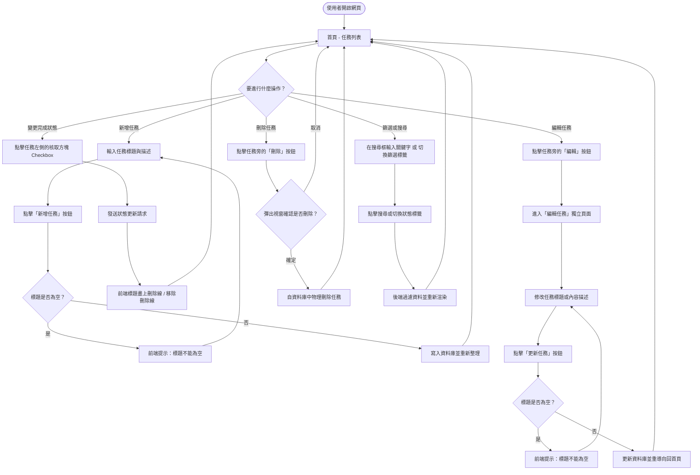

# 流程圖設計文件 (Flowcharts & Sequence Diagrams) - 任務管理系統

本文件包含本系統的**使用者流程圖 (User Flow)**、**系統序列圖 (Sequence Diagram)** 以及**功能清單對照表**，以視覺化方式呈現使用者的操作路徑與後端資料流。

---

## 1. 使用者流程圖 (User Flow)

此流程圖描述使用者進入網站後，如何進行各項任務管理操作：



---

## 2. 系統序列圖 (Sequence Diagram)

以下詳細描述系統在主要互動情境下，瀏覽器、Flask 後端、Model 與 SQLite 資料庫之間的資料流向。

### A. 新增任務流 (POST /tasks/add)
當使用者填寫表單並提交新任務時：

```mermaid
sequenceDiagram
    autonumber
    actor User as 使用者
    participant Browser as 瀏覽器
    participant Route as Flask Route (app/routes/main.py)
    participant Model as Task Model (app/models/task.py)
    database DB as SQLite (instance/database.db)

    User->>Browser: 填寫任務標題與描述，點擊「新增任務」
    Browser->>Route: POST /tasks/add (表單資料: title, description)
    activate Route
    Route->>Route: 驗證欄位是否合法 (例如 title != "")
    Note over Route: 驗證若失敗，回傳提示
    Route->>Model: 呼叫 Task.create(title, description)
    activate Model
    Model->>DB: 執行 SQL: INSERT INTO tasks (title, description, status) VALUES (?, ?, 'pending')
    DB-->>Model: 回傳寫入成功與新資料 ID
    Model-->>Route: 回傳 True
    deactivate Model
    Route-->>Browser: HTTP 302 重導向至首頁 (/)
    deactivate Route
    Browser->>Route: GET / (重新要求列表)
    Route-->>Browser: 回傳最新任務列表 HTML
    Browser-->>User: 畫面更新，新任務出現在列表中
```

### B. 切換完成狀態流 (POST /tasks/\<id\>/toggle)
使用者點擊 Checkbox，以非同步 (AJAX/fetch) 方式更新狀態：

```mermaid
sequenceDiagram
    autonumber
    actor User as 使用者
    participant Browser as 瀏覽器 (JS)
    participant Route as Flask Route (app/routes/main.py)
    participant Model as Task Model (app/models/task.py)
    database DB as SQLite (instance/database.db)

    User->>Browser: 勾選/取消勾選任務狀態的 Checkbox
    Browser->>Route: POST /tasks/<id>/toggle (非同步請求)
    activate Route
    Route->>Model: 呼叫 Task.get_by_id(id)
    activate Model
    Model->>DB: 執行 SQL: SELECT * FROM tasks WHERE id = ?
    DB-->>Model: 回傳目前狀態
    Model-->>Route: 回傳 Task 物件
    deactivate Model
    Route->>Route: 計算新狀態 (若原本 completed 則改為 pending，反之亦然)
    Route->>Model: 呼叫 Task.update_status(id, new_status)
    activate Model
    Model->>DB: 執行 SQL: UPDATE tasks SET status = ? WHERE id = ?
    DB-->>Model: 更新成功
    Model-->>Route: 回傳 True
    deactivate Model
    Route-->>Browser: HTTP 200 回傳 JSON 成功訊息 { "success": true, "status": "new_status" }
    deactivate Route
    Browser->>Browser: 動態調整前端樣式 (加/去刪除線)，不刷新整頁
```

### C. 刪除任務流 (POST /tasks/\<id\>/delete)
使用者確認要刪除某個任務時：

```mermaid
sequenceDiagram
    autonumber
    actor User as 使用者
    participant Browser as 瀏覽器
    participant Route as Flask Route (app/routes/main.py)
    participant Model as Task Model (app/models/task.py)
    database DB as SQLite (instance/database.db)

    User->>Browser: 點擊「刪除」並在確認視窗點選「確定」
    Browser->>Route: POST /tasks/<id>/delete
    activate Route
    Route->>Model: 呼叫 Task.delete(id)
    activate Model
    Model->>DB: 執行 SQL: DELETE FROM tasks WHERE id = ?
    DB-->>Model: 刪除成功
    Model-->>Route: 回傳 True
    deactivate Model
    Route-->>Browser: HTTP 302 重導向至首頁 (/)
    deactivate Route
    Browser->>Route: GET /
    Route-->>Browser: 回傳最新任務列表 HTML (已排除已刪除任務)
    Browser-->>User: 畫面更新，任務從列表中消失
```

---

## 3. 功能清單對照表 (Route Map)

本專案規劃的 URL 路由、HTTP 方法及對應的功能實作對照如下表：

| 功能項目 | 頁面/功能描述 | 路由路徑 (URL Path) | HTTP 方法 | 回傳型態 | 備註 |
| :--- | :--- | :--- | :--- | :--- | :--- |
| **首頁 / 任務列表** | 顯示首頁、支援關鍵字搜尋與狀態篩選 | `/` | `GET` | HTML (`index.html`) | 支援 Query String 如 `?status=completed&keyword=專題` |
| **新增任務** | 接收新增表單提交，儲存後重導向 | `/tasks/add` | `POST` | Redirect to `/` | 欄位包含 `title` (必填) 與 `description` |
| **編輯任務頁面** | 渲染並呈現編輯任務表單 | `/tasks/<int:task_id>/edit` | `GET` | HTML (`edit.html`) | 載入單一任務舊有資料 |
| **更新任務內容** | 接收編輯表單提交，更新後重導向 | `/tasks/<int:task_id>/edit` | `POST` | Redirect to `/` | 欄位包含 `title` (必填) 與 `description` |
| **刪除任務** | 刪除指定任務，刪除後重導向 | `/tasks/<int:task_id>/delete`| `POST` | Redirect to `/` | 刪除操作為物理刪除 |
| **切換任務狀態** | 切換任務完成狀態 (已完成/未完成) | `/tasks/<int:task_id>/toggle`| `POST` | JSON | 供前端 JavaScript `fetch` 非同步呼叫，不需整頁刷新 |
